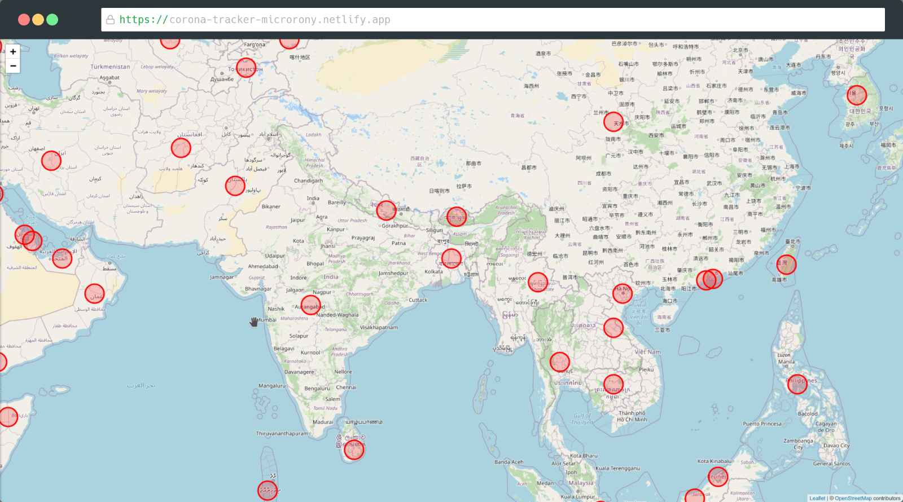

# corona-tracker

This React map has all the information about the current pandemic. You can see how many people are affected, death, and recovered by the virus. It has many scopes for improvement. I am working on some new features like dashboard and search.

## Live Site

[Click here to see the live site](https://corona-tracker-microrony.netlify.app/)
## Built With

* [React](https://reactjs.org/) - The JavaScript framework used
* [React Leaflet](https://react-leaflet.js.org/) - React components for Leaflet maps
* [JavaScript](https://www.javascript.com/) - Programming language used
* [Axiox](https://github.com/axios/axios) - HTTP client used